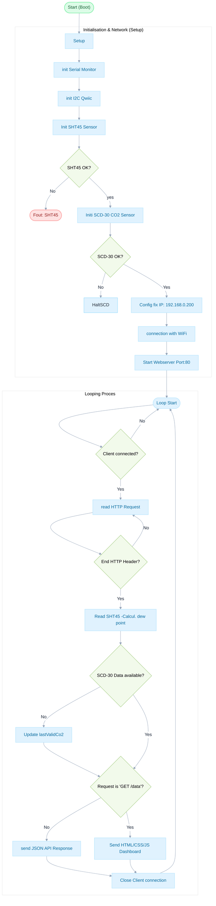

# Thermoregulation SHD45 & SCD-30
##### Georges Hart - september '26

```mermaid

%%{init: {'theme': 'base', 'themeVariables': { 'background': '#ffffff', 'edgeLabelBackground': '#ffffff', 'primaryColor': '#e0f2fe', 'primaryTextColor': '#1e293b', 'primaryBorderColor': '#7dd3fc', 'lineColor': '#94a3b8', 'secondaryColor': '#f1f5f9', 'tertiaryColor': '#ffffff' }}}%%


flowchart TD
    Start(["Start (Boot)"]) --> Setup[Setup]
    
    subgraph Setup_Phase ["Initialisation & Network (Setup)"]
        Setup --> InitSerial[init Serial Monitor]
        InitSerial --> InitI2C[init I2C Qwiic]
        InitI2C --> InitSHT[Init SHT45 Sensor]
        InitSHT --> CheckSHT{SHT45 OK?}
        CheckSHT -- No --> HaltSHT([Fout: SHT45])
        CheckSHT -- yes --> InitSCD[Initi SCD-30 CO2 Sensor]
        InitSCD --> CheckSCD{SCD-30 OK?}
        CheckSCD -- No --> HaltSCD
        CheckSCD -- Yes --> ConfigIP[Config fix IP: 192.168.0.200]
        ConfigIP --> ConnectWiFi[connection with WiFi]
        ConnectWiFi --> StartServer[Start Webserver Port:80]
    end

    StartServer --> Loop

    subgraph Loop_Phase ["Looping Proces"]
        Loop([Loop Start]) --> CheckClient{Client connected?}
        CheckClient -- No --> Loop
        CheckClient -- Yes --> ReadReq[read HTTP Request]
        
        ReadReq --> CheckEnd{End HTTP Header?}
        CheckEnd -- No --> ReadReq
        CheckEnd -- Yes --> ReadSensors[Read SHT45 -Calcul. dew point]
        
        ReadSensors --> CheckCO2{SCD-30 Data available?}
        CheckCO2 -- No --> UpdateCO2[Update lastValidCo2] --> CheckEndpoint
        CheckCO2 -- Yes --> CheckEndpoint{Request is 'GET /data'?}
        
        CheckEndpoint -- No --> SendJSON[send JSON API Response] --> CloseClient
        CheckEndpoint -- Yes --> SendHTML[Send HTML/CSS/JS Dashboard] --> CloseClient
        
        CloseClient[Close Client connection] --> Loop
    end

    %% Zachte pastelstijlen voor afdrukken
    classDef startNode fill:#dcfce7,stroke:#86efac,color:#166534,stroke-width:2px;
    classDef processNode fill:#e0f2fe,stroke:#bae6fd,color:#0369a1,stroke-width:1.5px;
    classDef decisionNode fill:#F2FAEB,stroke:#B3D496, color:#000000,stroke-width:1.5px;
    classDef errorNode fill:#fee2e2,stroke:#fca5a5,color:#991b1b,stroke-width:2px;

    class Start startNode;
    class Setup,InitSerial,InitI2C,InitSHT,InitSCD,ConfigIP,ConnectWiFi,StartServer,Loop,ReadReq,ReadSensors,UpdateCO2,SendJSON,SendHTML,CloseClient processNode;
    class CheckSHT,CheckSCD,CheckClient,CheckEnd,CheckCO2,CheckEndpoint decisionNode;
    class HaltSHT errorNode;


```

